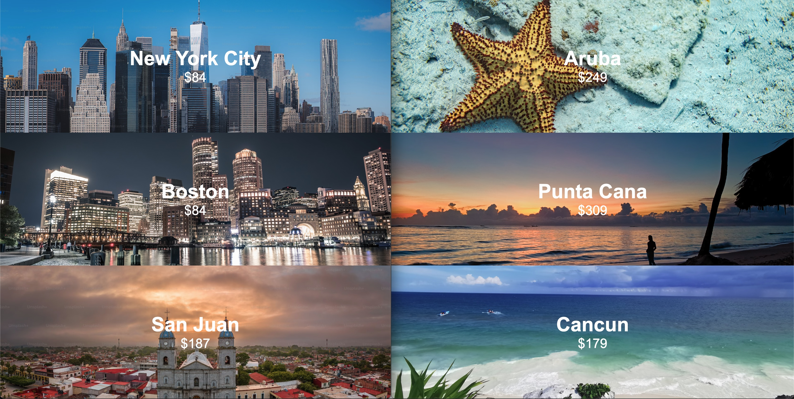

# Harness Split Carousel
Author: david.martin@harness.io

Display a set of destinations with fare prices.
The suggested dynamic config shows cheaper fares with "off" treatment
and more popular, expensive fares with "on" treatment.

Clicking on a fare sends an event including a property 
with the fare and destination specified.

Demonstrates
 - dynamic config
 - server-side flag evaluation
 - client-side notification and update
 - experimentation

Off/On side-by-side


## server.js

node.js express "destinations" api tests a flag called "carousel"
and returns the JSON associated with its treatment.

The on treatment's tested JSON was...
```json
[
  {
    "name": "Aruba",
    "fare": 249,
    "imgUrl": "https://plus.unsplash.com/premium_photo-1693932440279-50a3466eac5c?q=80&w=3540&auto=format&fit=crop&ixlib=rb-4.0.3&ixid=M3wxMjA3fDB8MHxwaG90by1wYWdlfHx8fGVufDB8fHx8fA%3D%3D"
  },
  {
    "name": "Punta Cana",
    "fare": 309,
    "imgUrl": "https://images.unsplash.com/photo-1504897264915-7a1d030ccd00?q=80&w=3433&auto=format&fit=crop&ixlib=rb-4.0.3&ixid=M3wxMjA3fDB8MHxwaG90by1wYWdlfHx8fGVufDB8fHx8fA%3D%3D" 
  },
  {
    "name": "Cancun",
    "fare": 179,
    "imgUrl": "https://images.unsplash.com/photo-1666051637751-19d52e003355?q=80&w=3474&auto=format&fit=crop&ixlib=rb-4.0.3&ixid=M3wxMjA3fDB8MHxwaG90by1wYWdlfHx8fGVufDB8fHx8fA%3D%3D"
  }
]
```

The off tretment tested JSON was...
```
[
  {
    "name": "New York City",
    "fare": 84,
    "imgUrl": "https://plus.unsplash.com/premium_photo-1682656220562-32fde8256295?q=80&w=3432&auto=format&fit=crop&ixlib=rb-4.0.3&ixid=M3wxMjA3fDB8MHxwaG90by1wYWdlfHx8fGVufDB8fHx8fA%3D%3D"
  },
  {
    "name": "Boston",
    "fare": 84,
    "imgUrl": "https://images.unsplash.com/photo-1506551907304-60bb62ffc9b0?q=80&w=3540&auto=format&fit=crop&ixlib=rb-4.0.3&ixid=M3wxMjA3fDB8MHxwaG90by1wYWdlfHx8fGVufDB8fHx8fA%3D%3D" 
  },
  {
    "name": "San Juan",
    "fare": 187,
    "imgUrl": "https://plus.unsplash.com/premium_photo-1697730089767-45e915ef27f9?q=80&w=3313&auto=format&fit=crop&ixlib=rb-4.0.3&ixid=M3wxMjA3fDB8MHxwaG90by1wYWdlfHx8fGVufDB8fHx8fA%3D%3D"
  }
]
```

## test.js

node.js script that simulated traffic, sending impressions and events for three thousand users.

## index.html

Run the demonstration using this HTML locally.

The HTML does use the Split SDK, but not to evaluate a flag.

It uses SDK_UPDATE to detect the flag has changed.
This triggers an axios call to the server-side "destinations" API.

The script uses the Document Object Model to build and rebuild
the destination panes dynamically in response to the JSON it
receives from the destination API.

Date: August 12, 2024
